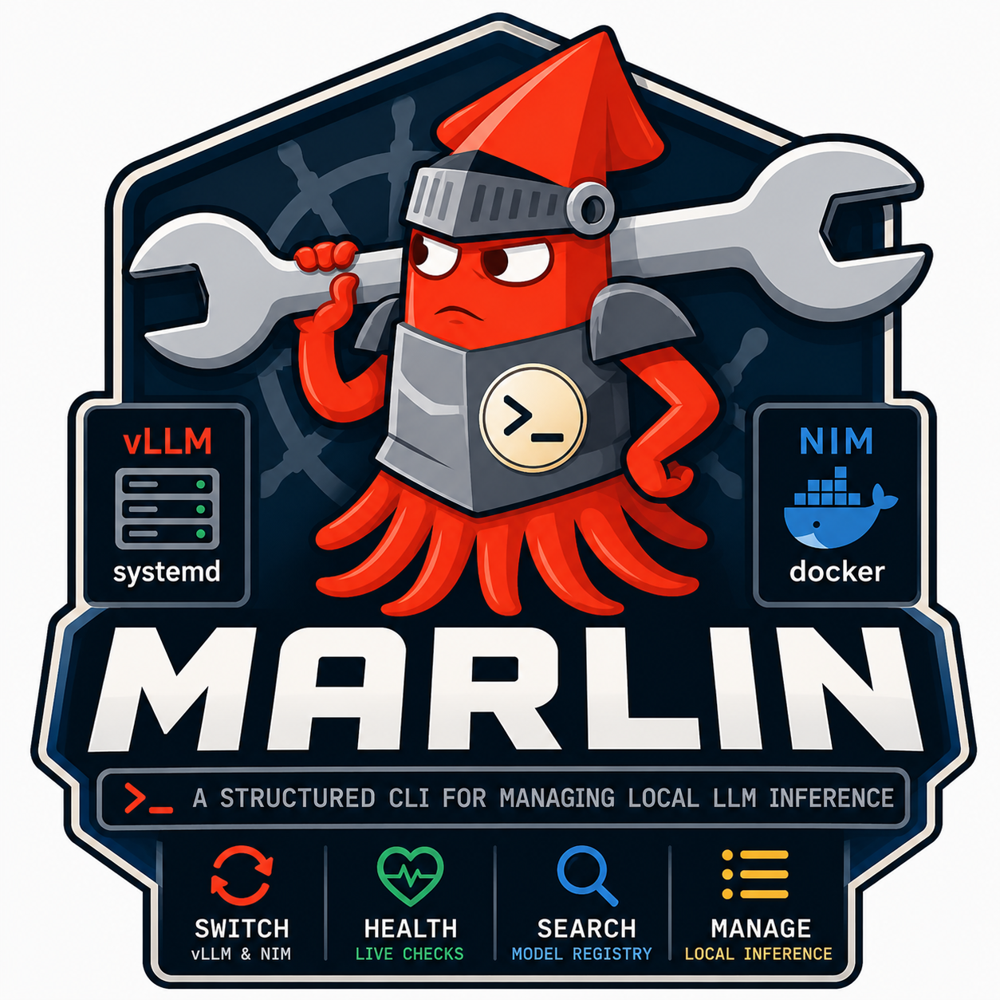

<p align="center">
  
</p>

<h1 align="center">marlin</h1>

<p align="center">An opinionated CLI for managing local LLM inference. Handles vLLM (systemd) and NIM (Docker) model switching, live health checks, and registry searches.</p>

## Features

- **Two provider types** — `vllm` (systemd service + env-file symlink) and `nim` (Docker, TensorRT-LLM)
- **Interactive TUI** — fuzzy model picker and multi-step add wizard (bubbletea)
- **Atomic symlink swap** — zero-gap model.env rotation
- **Registry search** — HuggingFace and NGC API
- **Validation** — quantization mismatch, GPU memory, served-model-name alias checks
- **Privilege escalation** — prompts for `sudo` if not running as root (like `systemctl`)
- **State tracking** — persists active model, provider, and container ID across reboots

## Installation

### From release (recommended)

```bash
# .deb (Ubuntu/Debian)
curl -LO https://github.com/DavidXArnold/marlin/releases/latest/download/marlin_linux_arm64.deb
sudo dpkg -i marlin_linux_arm64.deb

# .rpm (RHEL/Fedora)
curl -LO https://github.com/DavidXArnold/marlin/releases/latest/download/marlin_linux_arm64.rpm
sudo rpm -i marlin_linux_arm64.rpm
```

### From source

```bash
git clone https://github.com/DavidXArnold/marlin.git
cd marlin
make install
```

## Configuration

Copy the example config and edit for your environment:

```bash
sudo cp configs/marlin.toml.example /etc/marlin/config.toml
sudo $EDITOR /etc/marlin/config.toml
```

Key paths (all overridable in config):

| Setting | Default | Purpose |
|---|---|---|
| `paths.models_dir` | `/etc/marlin/models` | TOML model configs and rendered `.env` files |
| `paths.active_symlink` | `/etc/marlin/model.env` | Symlink pointing at the active model's env file |
| `paths.secrets_env` | `/etc/marlin/secrets.env` | `HF_TOKEN` and `NGC_API_KEY` |
| `paths.state_file` | `/var/lib/marlin/state.toml` | Active model/provider state |
| `paths.nim_cache` | `/var/cache/nim` | Host path mounted into NIM containers |
| `server.alias` | `gn100` | Served-model-name alias expected by clients |

Secrets file format (`/etc/marlin/secrets.env`):

```
HF_TOKEN=hf_...
NGC_API_KEY=nvapi-...
```

## Commands

### `marlin list`

```
SLUG                           TYPE   STATUS     MODEL ID
----                           ----   ------     --------
qwen25-72b-awq                 vllm   working    Qwen/Qwen2.5-72B-Instruct-AWQ  ◀ active
llama-3.1-8b-nim               nim    untested   nvcr.io/nim/meta/llama-3.1-8b-instruct:latest
```

### `marlin switch [model]`

Switch the active inference model. Presents an interactive fuzzy picker when no
argument is given. Prompts for `sudo` if not already root, then:
1. Validates the target model config
2. Writes the rendered `.env` file to `models_dir`
3. Atomically replaces the `active_symlink`
4. Restarts the vLLM systemd unit (or stops the old NIM container and starts the new one)

```bash
marlin switch qwen25-72b-awq
marlin switch          # interactive picker
```

### `marlin add [registry-id]`

Interactive wizard for creating a new model config. Steps:
provider type → model ID or NIM image → slug → quantization → GPU memory → served names → confirm.
Writes a `.toml` file to `paths.models_dir`.

```bash
marlin add
marlin add Qwen/Qwen2.5-72B-Instruct-AWQ
```

### `marlin validate <model>`

Run validation checks without switching.

```bash
marlin validate qwen25-72b-awq
# [warn] serve.gpu_memory_utilization 0.970 is very high (>0.95)
```

### `marlin status`

```
active model : qwen25-72b-awq
provider     : vllm
api health   : ready at http://localhost:8000/v1
```

### `marlin logs [-f] [--lines N]`

Stream inference service logs via `journalctl` (vLLM) or `docker logs` (NIM).

```bash
marlin logs -f
marlin logs --lines 200
```

### `marlin search <query>`

Search HuggingFace and NGC for models.

```bash
marlin search "Qwen 72B"
marlin search --registry ngc llama
```

## Model config format

Each model is a TOML file in `paths.models_dir`. Example for a vLLM model:

```toml
[model]
id     = "Qwen/Qwen2.5-72B-Instruct-AWQ"
type   = "vllm"
status = "working"
notes  = "Best for tool-calling on GN100"

[serve]
quantization          = "awq_marlin"
gpu_memory_utilization = 0.90
max_model_len          = 131072
served_model_name      = ["gn100", "qwen25-72b"]
tool_call_parser       = "hermes"
```

For a NIM model:

```toml
[model]
image  = "nvcr.io/nim/meta/llama-3.1-8b-instruct:latest"
type   = "nim"
status = "untested"
```

## Development

```bash
make test          # run tests
make coverage      # coverage report + gate (85%)
make coverage-html # open HTML report
make lint          # golangci-lint
make check         # lint + coverage (CI target)
make build         # compile to bin/marlin
```

### Integration tests

Integration tests that require a running server are tagged `Integration` and skipped by default:

```bash
MARLIN_TEST_HOST=localhost:8000 make integration
```

### E2E smoke test

```bash
# Requires a running inference server
MARLIN_TEST_MODEL=qwen25-72b-awq make e2e
```

## Architecture

```
cmd/                    Cobra commands (switch, add, list, validate, status, logs, search)
internal/
  config/               Global config + per-model TOML schema
  provider/             Provider interface + VLLMProvider + NIMProvider
  service/              Systemd wrapper (IsActive, Restart, Stop, Logs)
  state/                Persistent state (active model, provider, container ID)
  ui/                   bubbletea TUI (fuzzy picker, add wizard, confirm)
  validate/             Model config validation (quantization, GPU mem, aliases)
  registry/             HuggingFace + NGC registry clients
  secrets/              Dotenv secrets loader
  privilege/            Sudo re-exec escalation
  vllm/                 OpenAI-compatible health + model list client
pkg/
  render/               Env file renderer (model config → KEY=VALUE)
```

## License

GNU General Public License v3.0 — see [LICENSE](LICENSE).
